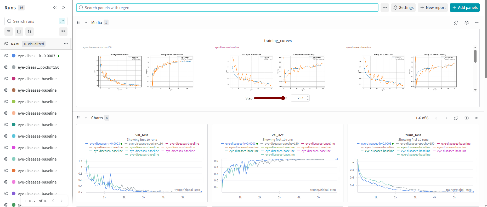
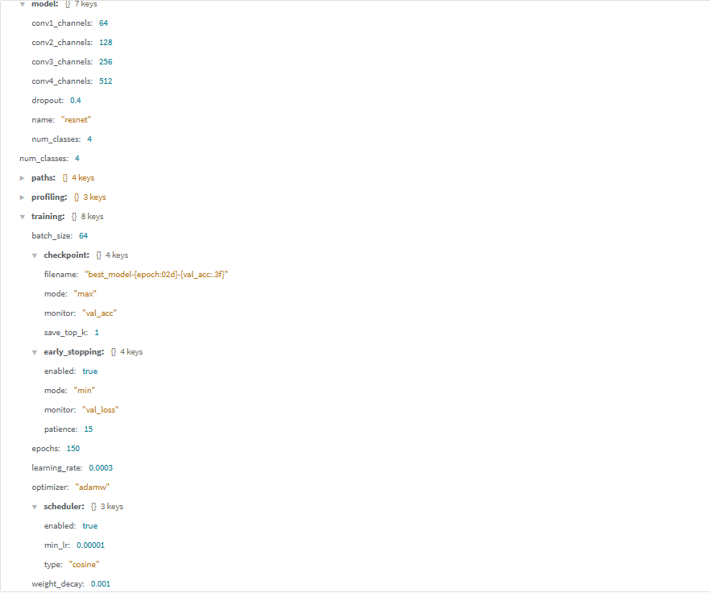
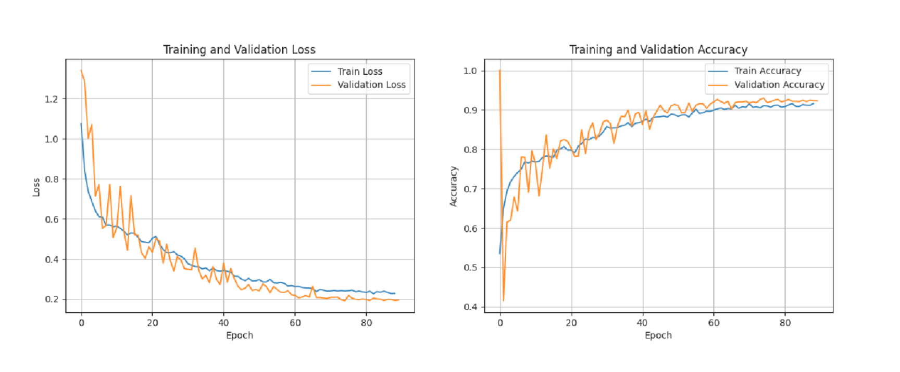
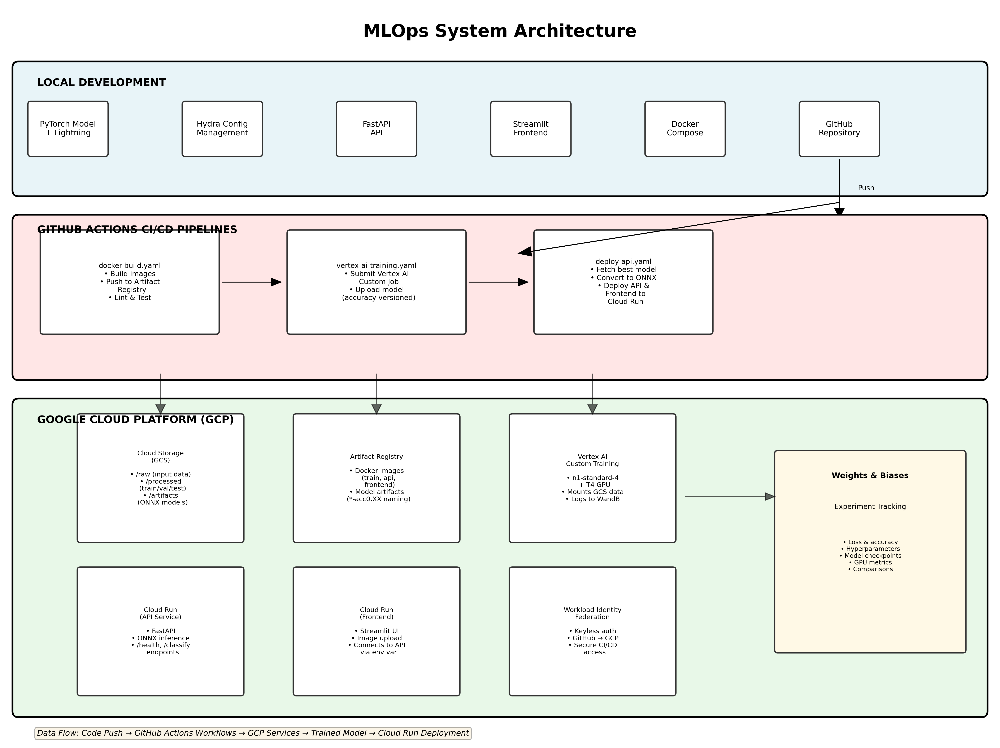
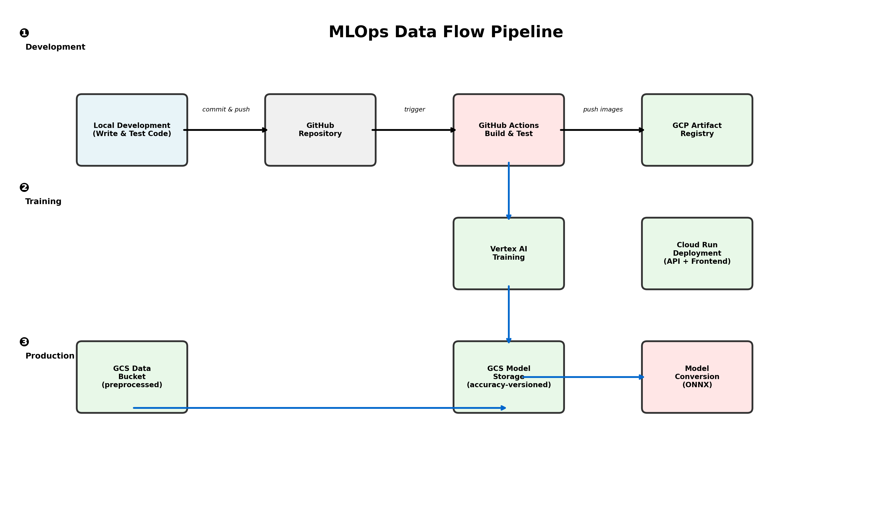

# Exam template for 02476 Machine Learning Operations

This is the report template for the exam. Please only remove the text formatted as with three dashes in front and behind
like:

```--- question 1 fill here ---```

Where you instead should add your answers. Any other changes may have unwanted consequences when your report is
auto-generated at the end of the course. For questions where you are asked to include images, start by adding the image
to the `figures` subfolder (please only use `.png`, `.jpg` or `.jpeg`) and then add the following code in your answer:

``

In addition to this markdown file, we also provide the `report.py` script that provides two utility functions:

Running:

```bash
python report.py html
```

Will generate a `.html` page of your report. After the deadline for answering this template, we will auto-scrape
everything in this `reports` folder and then use this utility to generate a `.html` page that will be your serve
as your final hand-in.

Running

```bash
python report.py check
```

Will check your answers in this template against the constraints listed for each question e.g. is your answer too
short, too long, or have you included an image when asked. For both functions to work you mustn't rename anything.
The script has two dependencies that can be installed with

```bash
pip install typer markdown
```

or

```bash
uv add typer markdown
```

## Overall project checklist

The checklist is *exhaustive* which means that it includes everything that you could do on the project included in the
curriculum in this course. Therefore, we do not expect at all that you have checked all boxes at the end of the project.
The parenthesis at the end indicates what module the bullet point is related to. Please be honest in your answers, we
will check the repositories and the code to verify your answers.

### Week 1

* [x] Create a git repository (M5)
* [x] Make sure that all team members have write access to the GitHub repository (M5)
* [x] Create a dedicated environment for you project to keep track of your packages (M2)
* [x] Create the initial file structure using cookiecutter with an appropriate template (M6)
* [x] Fill out the `data.py` file such that it downloads whatever data you need and preprocesses it (if necessary) (M6)
* [x] Add a model to `model.py` and a training procedure to `train.py` and get that running (M6)
* [x] Remember to either fill out the `requirements.txt`/`requirements_dev.txt` files or keeping your
    `pyproject.toml`/`uv.lock` up-to-date with whatever dependencies that you are using (M2+M6)
* [x] Remember to comply with good coding practices (`pep8`) while doing the project (M7)
* [x] Do a bit of code typing and remember to document essential parts of your code (M7)
* [ ] Setup version control for your data or part of your data (M8)
* [x] Add command line interfaces and project commands to your code where it makes sense (M9)
* [x] Construct one or multiple docker files for your code (M10)
* [x] Build the docker files locally and make sure they work as intended (M10)
* [x] Write one or multiple configurations files for your experiments (M11)
* [x] Used Hydra to load the configurations and manage your hyperparameters (M11)
* [x] Use profiling to optimize your code (M12)
* [x] Use logging to log important events in your code (M14)
* [x] Use Weights & Biases to log training progress and other important metrics/artifacts in your code (M14)
* [x] Consider running a hyperparameter optimization sweep (M14)
* [x] Use PyTorch-lightning (if applicable) to reduce the amount of boilerplate in your code (M15)

### Week 2

* [x] Write unit tests related to the data part of your code (M16)
* [x] Write unit tests related to model construction and or model training (M16)
* [x] Calculate the code coverage (M16)
* [x] Get some continuous integration running on the GitHub repository (M17)
* [ ] Add caching and multi-os/python/pytorch testing to your continuous integration (M17)
* [x] Add a linting step to your continuous integration (M17)
* [x] Add pre-commit hooks to your version control setup (M18)
* [ ] Add a continues workflow that triggers when data changes (M19)
* [x] Add a continues workflow that triggers when changes to the model registry is made (M19)
* [ ] Create a data storage in GCP Bucket for your data and link this with your data version control setup (M21)
* [x] Create a trigger workflow for automatically building your docker images (M21)
* [x] Get your model training in GCP using either the Engine or Vertex AI (M21)
* [x] Create a FastAPI application that can do inference using your model (M22)
* [x] Deploy your model in GCP using either Functions or Run as the backend (M23)
* [x] Write API tests for your application and setup continues integration for these (M24)
* [x] Load test your application (M24)
* [x] Create a more specialized ML-deployment API using either ONNX or BentoML, or both (M25)
* [x] Create a frontend for your API (M26)

### Week 3

* [x] Check how robust your model is towards data drifting (M27)
* [x] Setup collection of input-output data from your deployed application (M27)
* [x] Deploy to the cloud a drift detection API (M27)
* [ ] Instrument your API with a couple of system metrics (M28)
* [x] Setup cloud monitoring of your instrumented application (M28)
* [ ] Create one or more alert systems in GCP to alert you if your app is not behaving correctly (M28)
* [ ] If applicable, optimize the performance of your data loading using distributed data loading (M29)
* [ ] If applicable, optimize the performance of your training pipeline by using distributed training (M30)
* [ ] Play around with quantization, compilation and pruning for you trained models to increase inference speed (M31)

### Extra

* [ ] Write some documentation for your application (M32)
* [ ] Publish the documentation to GitHub Pages (M32)
* [ ] Revisit your initial project description. Did the project turn out as you wanted?
* [ ] Create an architectural diagram over your MLOps pipeline
* [x] Make sure all group members have an understanding about all parts of the project
* [x] Uploaded all your code to GitHub

## Group information

### Question 1
> **Enter the group number you signed up on <learn.inside.dtu.dk>**
>
> Answer:

43

### Question 2
> **Enter the study number for each member in the group**
>
> Example:
>
> *sXXXXXX, sXXXXXX, sXXXXXX*
>
> Answer:

s253414, s260263, s214642

### Question 3
> **Did you end up using any open-source frameworks/packages not covered in the course during your project? If so**
> **which did you use and how did they help you complete the project?**
>
> Recommended answer length: 0-200 words.
>
> Example:
> *We used the third-party framework ... in our project. We used functionality ... and functionality ... from the*
> *package to do ... and ... in our project*.
>
> Answer:

We only used frameworks/packages covered in this course during the classes.

## Coding environment

> In the following section we are interested in learning more about you local development environment. This includes
> how you managed dependencies, the structure of your code and how you managed code quality.

### Question 4

> **Explain how you managed dependencies in your project? Explain the process a new team member would have to go**
> **through to get an exact copy of your environment.**
>
> Recommended answer length: 100-200 words
>
> Example:
> *We used ... for managing our dependencies. The list of dependencies was auto-generated using ... . To get a*
> *complete copy of our development environment, one would have to run the following commands*
>
> Answer:

We managed dependencies in our project using uv, a Python package and environment manager, together with the "pyproject.toml" specification. All project dependencies are declared in the "pyproject.toml" file, including core libraries such as PyTorch, PyTorch Lightning, FastAPI, Hydra, and Weights & Biases, as well as a separate development dependency group for testing, linting, documentation, and CI tools (e.g. pytest, ruff, coverage). 
Exact versions of all dependencies, including transitive dependencies and platform-specific wheels, are locked in the uv.lock file. This lock file ensures full reproducibility across different machines. To get an exact copy of the development environment, a new team member would clone the repository, install uv, and run: "uv sync --dev --locked".
This command recreates the environment using the exact versions specified in "uv.lock".

### Question 5

> **We expect that you initialized your project using the cookiecutter template. Explain the overall structure of your**
> **code. What did you fill out? Did you deviate from the template in some way?**
>
> Recommended answer length: 100-200 words
>
> Example:
> *From the cookiecutter template we have filled out the ... , ... and ... folder. We have removed the ... folder*
> *because we did not use any ... in our project. We have added an ... folder that contains ... for running our*
> *experiments.*
>
> Answer:

From the cookiecutter template we have filled out the dockerfiles, .github, src and tests folders. We have added a logs folder that contains training and evaluation logs for monitoring and debugging purposes.

### Question 6

> **Did you implement any rules for code quality and format? What about typing and documentation? Additionally,**
> **explain with your own words why these concepts matters in larger projects.**
>
> Recommended answer length: 100-200 words.
>
> Example:
> *We used ... for linting and ... for formatting. We also used ... for typing and ... for documentation. These*
> *concepts are important in larger projects because ... . For example, typing ...*
>
> Answer:

We implemented several rules to ensure code quality and formatting throughout the project. For linting and formatting, we used Ruff, which is executed both locally and automatically in our GitHub Actions workflows. Ruff enforces consistent code style, checks for common Python errors, and ensures compliance with best practices such as PEP8. Formatting is also enforced using ruff format, guaranteeing a uniform codebase across contributors.
We also included mypy in the CI pipeline, which is capable of checking type hints in Python.
Additionally, we added meaningful inline comments in core modules to explain functionality. These practices improve readability, reduce bugs, and make collaboration easier in larger projects.

## Version control

> In the following section we are interested in how version control was used in your project during development to
> corporate and increase the quality of your code.

### Question 7

> **How many tests did you implement and what are they testing in your code?**
>
> Recommended answer length: 50-100 words.
>
> Example:
> *In total we have implemented X tests. Primarily we are testing ... and ... as these the most critical parts of our*
> *application but also ... .*
>
> Answer:

In total, we have implemented 39 unit tests using pytest, which are executed automatically in our CI pipeline. These tests primarily cover the core functionality of our project, including dataset loading and preprocessing, image normalization and augmentation, model initialization, forward pass, training, validation, testing steps, and optimizer configuration. By verifying that inputs produce the expected outputs and that key logic behaves correctly, these tests help catch bugs early, ensure reproducibility, and maintain code reliability as the project grows.

### Question 8

> **What is the total code coverage (in percentage) of your code? If your code had a code coverage of 100% (or close**
> **to), would you still trust it to be error free? Explain you reasoning.**
>
> Recommended answer length: 100-200 words.
>
> Example:
> *The total code coverage of code is X%, which includes all our source code. We are far from 100% coverage of our **
> *code and even if we were then...*
>
> Answer:

We have a total code coverage of 73%. This coverage includes all core source files, such as the data loading pipeline, model definition, and API code.
While this is a reasonable coverage level, we are far from 100% coverage of our code, and even if we were, we should not trust it to be completely error-free.
Code coverage only measures line execution, not correctness. A line can execute successfully without being logically correct. For example, a function might return an incorrect value but still execute without crashing, making it pass coverage metrics while failing logically. Additionally, there can be other issues such as integration between individual units and/or external dependencies that are not captured by unit tests alone.
To improve code quality beyond coverage metrics, we employ additional measures: type checking with mypy, linting and formatting with ruff, code reviews via pull requests, and integration testing. These practices help catch issues that coverage alone cannot detect. Therefore, while our 73% coverage provides reasonable assurance, we recognize it as one component of a multi-layered approach to code quality, not as a guarantee of error-free code.

### Question 9

> **Did you workflow include using branches and pull requests? If yes, explain how. If not, explain how branches and**
> **pull request can help improve version control.**
>
> Recommended answer length: 100-200 words.
>
> Example:
> *We made use of both branches and PRs in our project. In our group, each member had an branch that they worked on in*
> *addition to the main branch. To merge code we ...*
>
> Answer:

Yes, our workflow included using both branches and pull requests (PRs) to manage version control effectively. Each team member worked on a separate branch, keeping the main branch stable and production-ready. Once a feature was complete, the developer created a PR to merge their branch into main, which was merged only after being reviewed and approved by another team member. This PR triggered automated CI workflows, including tests, linting, formatting checks, and type checking. Additionally, PRs enabled code reviews, allowing the team to provide feedback and catch potential issues before merging. Using branches and PRs improves collaboration, reduces conflicts, and maintains a clear history of changes, making it easier to track progress, revert changes if needed, and keep the project clean and maintainable.

### Question 10

> **Did you use DVC for managing data in your project? If yes, then how did it improve your project to have version**
> **control of your data. If no, explain a case where it would be beneficial to have version control of your data.**
>
> Recommended answer length: 100-200 words.
>
> Example:
> *We did make use of DVC in the following way: ... . In the end it helped us in ... for controlling ... part of our*
> *pipeline*
>
> Answer:

We ended up not using DVC in our project due to some technical issues during setup. Instead, we chose to upload our data directly to Google Cloud Platform (GCP) for storage and access. While this approach allowed us to share data among team members and integrate it with our training pipelines, it does not provide the full benefits of data versioning.

### Question 11

> **Discuss you continuous integration setup. What kind of continuous integration are you running (unittesting,**
> **linting, etc.)? Do you test multiple operating systems, Python  version etc. Do you make use of caching? Feel free**
> **to insert a link to one of your GitHub actions workflow.**
>
> Recommended answer length: 200-300 words.
>
> Example:
> *We have organized our continuous integration into 3 separate files: one for doing ..., one for running ... testing*
> *and one for running ... . In particular for our ..., we used ... .An example of a triggered workflow can be seen*
> *here: <weblink>*
>
> Answer:

We organized our continuous integration (CI) setup into multiple GitHub Actions workflows to ensure code quality, correctness, and reproducibility. First, we have a unit testing workflow (test.yaml) that installs project dependencies using uv and runs all tests with pytest and coverage. This workflow also performs static type checking with mypy and ensures code formatting and linting rules using ruff. Second, we maintain a linting and formatting workflow (linting.yaml) that verifies consistent code style and enforces project-specific rules for readability and maintainability.

Our CI workflows run on Ubuntu-based virtual environments and are configured to use Python 3.12. While we currently do not test multiple OSes or Python versions, the setup can be easily extended using GitHub Actions’ matrix feature to test across different configurations. We also leverage dependency caching where possible (e.g., pip caching) to speed up workflow execution and reduce redundant downloads.

These workflows are triggered automatically on push or pull request events to the main or master branches, ensuring that every change is validated before being merged. This allows us to catch issues early, enforce consistent coding standards, and maintain a stable main branch. By integrating testing, linting, formatting and type checking into the CI pipeline, we reduce the likelihood of bugs, make code easier to maintain, and streamline collaboration among team members.
An example of a triggered workflow can be seen here: https://github.com/franciscoalves04/Mlops_project_Group43/actions/runs/21177408657/job/60909944186

## Running code and tracking experiments

> In the following section we are interested in learning more about the experimental setup for running your code and
> especially the reproducibility of your experiments.

### Question 12

> **How did you configure experiments? Did you make use of config files? Explain with coding examples of how you would**
> **run a experiment.**
>
> Recommended answer length: 50-100 words.
>
> Example:
> *We used a simple argparser, that worked in the following way: Python  my_script.py --lr 1e-3 --batch_size 25*
>
> Answer:

We used Hydra for hierarchical configuration management with YAML config files in `src/eye_diseases_classification/conf/`. To run experiments with default config: `uv run train`. To override parameters: `uv run train training.batch_size=32 model.learning_rate=0.0005`. To run pre-defined experiments: `uv run train +experiment=high_lr` or `+experiment=large_batch`. Hydra auto-saves all configs to timestamped output folders, ensuring full reproducibility of every experiment run.

### Question 13

> **Reproducibility of experiments are important. Related to the last question, how did you secure that no information**
> **is lost when running experiments and that your experiments are reproducible?**
>
> Recommended answer length: 100-200 words.
>
> Example:
> *We made use of config files. Whenever an experiment is run the following happens: ... . To reproduce an experiment*
> *one would have to do ...*
>
> Answer:

We secured reproducibility through multiple mechanisms. Whenever an experiment is run, Hydra automatically creates a timestamped output folder (e.g., `outputs/2024-01-19/18-30-45/`) and saves the entire configuration in `.hydra/config.yaml`. We set a fixed random seed (`torch.manual_seed(42)`) in train.py and PyTorch Lightning's deterministic flag to ensure consistent results across runs. All training metrics, hyperparameters, and model artifacts are logged to WandB with experiment-specific IDs. Additionally, exact dependency versions are locked in `uv.lock`, ensuring identical environments across machines. To reproduce an experiment, one would: 1) check the saved config in the outputs folder, 2) run `uv run train` with the same CLI overrides, or 3) reference the exact WandB run ID which stores all hyperparameters and outputs. This comprehensive approach ensures no information is lost and all experiments remain fully reproducible.

### Question 14

> **Upload 1 to 3 screenshots that show the experiments that you have done in W&B (or another experiment tracking**
> **service of your choice). This may include loss graphs, logged images, hyperparameter sweeps etc. You can take**
> **inspiration from [this figure](figures/wandb.png). Explain what metrics you are tracking and why they are**
> **important.**
>
> Recommended answer length: 200-300 words + 1 to 3 screenshots.
>
> Example:
> *As seen in the first image when have tracked ... and ... which both inform us about ... in our experiments.*
> *As seen in the second image we are also tracking ... and ...*
>
> Answer:

We integrated Weights & Biases (W&B) into our training pipeline to comprehensively track all aspects of our experiments. As seen in the first image, we track training and validation loss across all epochs for all experiments, which informs us about model convergence and whether the model is overfitting or underfitting. Training loss should decrease monotonically while validation loss reveals if the model generalizes well to unseen data. Paired with loss metrics, we also track training and validation accuracy, which directly measure classification performance on the eye disease dataset. These metrics are critical because they show how well our model learns the underlying patterns.

As seen in the second image, we log all hyperparameters used in each experiment, including learning rate, batch size, model architecture parameters (conv channels, dropout), scheduler settings, and early stopping patience. This is essential for reproducibility and for understanding which hyperparameter configurations lead to better performance. W&B automatically captures these alongside system metrics like GPU memory usage and epoch duration, providing complete context for each run.

In the third image, we visualize the training curves (loss and accuracy plots) which are automatically generated and logged. These visualizations make it easy to identify training dynamics at a glance—detecting overfitting patterns, learning plateaus, or convergence issues. Beyond metrics, we also log model artifacts including the best checkpoint and final model state dict to W&B, enabling easy model versioning and comparison across experiments. This comprehensive tracking allows us to compare multiple experimental runs, identify which configurations work best, and maintain a complete audit trail of our model development process. W&B's dashboard enables team collaboration by allowing all members to view and compare experiments in real-time.






### Question 15

> **Docker is an important tool for creating containerized applications. Explain how you used docker in your**
> **experiments/project? Include how you would run your docker images and include a link to one of your docker files.**
>
> Recommended answer length: 100-200 words.
>
> Example:
> *For our project we developed several images: one for training, inference and deployment. For example to run the*
> *training docker image: `docker run trainer:latest lr=1e-3 batch_size=64`. Link to docker file: <weblink>*
>
> Answer:

For our project, we developed multiple Docker images: a training container (PyTorch-based with GPU support), an API inference container (FastAPI-based), and an optional frontend container (Streamlit-based). The training image uses a multi-stage build optimizing for cloud deployment with CUDA 12.4 support, while the API image is lightweight for efficient serving. Both images include environment isolation and non-root user execution for security.

To run the training container locally with GPU support:
```
docker run --gpus all -v ./data:/app/data -v ./models:/app/models \
  eye-diseases-train:latest
```

To run the API container:
```
docker run -p 8000:8000 -v ./models:/app/models:ro eye-diseases-api:latest
```

Alternatively, we use `docker-compose up` to orchestrate both services. The training image includes an entrypoint script that automatically downloads preprocessed data from Google Cloud Storage before training begins. All Docker images are automatically built and pushed to Google Artifact Registry through our GitHub Actions CI/CD pipeline on every code commit.

Link to training dockerfile: [dockerfiles/train.dockerfile](https://github.com/franciscoalves04/Mlops_project_Group43/blob/main/dockerfiles/train.dockerfile). 

NOTE: For building and running the training image, we did not make use of caching, as the Github Action Workflow was running out of space. 

### Question 16

> **When running into bugs while trying to run your experiments, how did you perform debugging? Additionally, did you**
> **try to profile your code or do you think it is already perfect?**
>
> Recommended answer length: 100-200 words.
>
> Example:
> *Debugging method was dependent on group member. Some just used ... and others used ... . We did a single profiling*
> *run of our main code at some point that showed ...*
>
> Answer:

Debugging was done mostly by the help of co-pilot. This was done by adding the python file as context and pasting the exact whole error that is outputted in the terminal. For profiling, this was done once locally on one of our members' GPU to see if there was a CPU bottleneck, which there was. To use more training time on the GPU, we bumped the batch_size up. 

## Working in the cloud

> In the following section we would like to know more about your experience when developing in the cloud.

### Question 17

> **List all the GCP services that you made use of in your project and shortly explain what each service does?**
>
> Recommended answer length: 50-200 words.
>
> Example:
> *We used the following two services: Engine and Bucket. Engine is used for... and Bucket is used for...*
>
> Answer:

We used the following GCP services in our project:

1. **Cloud Storage (GCS Buckets)**: Used for storing processed training data (gs://mlops-data-*.../processed) and models (gs://mlops-models-...). This provides scalable, reliable storage for both input data and trained model outputs.

2. **Vertex AI (Custom Jobs)**: Used for cloud-based model training. We configured custom training jobs with GPU support (NVIDIA TESLA T4 GPU) to train our PyTorch Lightning models at scale without managing infrastructure directly.

3. **Artifact Registry**: Used as a Docker registry to store and manage our training and API container images (europe-west1-docker.pkg.dev). Additionally, we store trained model artifacts with naming convention `*-acc0.XXX` to support ordering and filtering models by their validation accuracy, making it easy to identify and retrieve the best performing models. This integrates seamlessly with our CI/CD pipeline for automated image and model artifact management.

4. **Workload Identity Federation**: Used to establish secure, keyless authentication between GitHub Actions workflows and GCP services. This enables our CI/CD pipeline to authenticate and access GCP resources without storing service account keys.

### Question 18

> **The backbone of GCP is the Compute engine. Explained how you made use of this service and what type of VMs**
> **you used?**
>
> Recommended answer length: 100-200 words.
>
> Example:
> *We used the compute engine to run our ... . We used instances with the following hardware: ... and we started the*
> *using a custom container: ...*
>
> Answer:

While Compute Engine is the backbone of GCP, we did not directly manage Compute Engine instances ourselves. Instead, we used Vertex AI Custom Training Jobs, which abstracts away the infrastructure management and automatically provisions the necessary compute resources. When submitting a training job to Vertex AI, we specified the machine type `n1-standard-4` with a single GPU (NVIDIA TESLA T4). Vertex AI then automatically creates the required Compute Engine VM in the background, installs our custom Docker training container from Artifact Registry, mounts the GCS data bucket, and runs the training job. This approach simplified our infrastructure management—we only needed to specify the job configuration, container image, and hyperparameters through the `gcloud ai custom-jobs create` command, without needing to manually provision, configure, or manage individual VM instances. Once training completes, Vertex AI automatically tears down the VM to avoid unnecessary costs. This managed approach reduced operational overhead while providing the scalability and GPU support we needed for model training.

### Question 19

> **Insert 1-2 images of your GCP bucket, such that we can see what data you have stored in it.**
> **You can take inspiration from [this figure](figures/bucket.png).**
>
> Answer:
[Buckets Overview](figures/buckets_overview.png)
[Data Bucket](figures/buckets_data.png)
[Models Bucket](figures/buckets_model.png)


### Question 20

> **Upload 1-2 images of your GCP artifact registry, such that we can see the different docker images that you have**
> **stored. You can take inspiration from [this figure](figures/registry.png).**
>
> Answer:

[Image Artifacts](figures/artifact_images.png)
[Model Artifacts](figures/artifact_models.png)


### Question 21

> **Upload 1-2 images of your GCP cloud build history, so we can see the history of the images that have been build in**
> **your project. You can take inspiration from [this figure](figures/build.png).**
>
> Answer:

We did not use GCP Cloud Build for building Docker images. Instead, we leveraged GitHub Actions workflows for automated image building and pushing to Artifact Registry. Our `docker-build.yaml` workflow automatically triggers on code commits to build and push training and API images directly to `europe-west1-docker.pkg.dev/` using Docker's `build-push-action`. This approach provided better integration with our GitHub-based CI/CD pipeline and allowed us to manage all automation within GitHub Actions rather than using multiple GCP services. The built images are then stored in Artifact Registry with versioning based on git commit hash and branch name for easy tracking and retrieval during Vertex AI training job submissions.

### Question 22

> **Did you manage to train your model in the cloud using either the Engine or Vertex AI? If yes, explain how you did**
> **it. If not, describe why.**
>
> Recommended answer length: 100-200 words.
>
> Example:
> *We managed to train our model in the cloud using the Engine. We did this by ... . The reason we choose the Engine*
> *was because ...*
>
> Answer:

Yes, we successfully trained our model in the cloud using Vertex AI Custom Training Jobs. Our GitHub Actions workflow (`vertex-ai-training.yaml`) automatically triggers after docker-build completes, submitting a custom training job to Vertex AI with the following setup: machine type `n1-standard-4` with one NVIDIA TESLA T4 GPU, our custom PyTorch training container from Artifact Registry, and Hydra configuration for experiment management. The workflow executes `gcloud ai custom-jobs create` to submit the job, then polls the job status every 30 seconds until completion (with a 2-hour timeout). Upon successful completion, the trained model is automatically uploaded to GCS with a versioned naming convention including accuracy metrics (`*-acc0.XXX`) for easy identification and retrieval. We chose Vertex AI over Compute Engine because it abstracts infrastructure management—we only specify job configuration and let Vertex AI handle VM provisioning, container deployment, data mounting, and cleanup. This managed approach significantly reduced operational complexity while providing reliable GPU-accelerated training at scale.

## Deployment

### Question 23

> **Did you manage to write an API for your model? If yes, explain how you did it and if you did anything special. If**
> **not, explain how you would do it.**
>
> Recommended answer length: 100-200 words.
>
> Example:
> *We did manage to write an API for our model. We used FastAPI to do this. We did this by ... . We also added ...*
> *to the API to make it more ...*
>
> Answer:

Yes, we successfully developed a FastAPI API for model inference. The API (`src/eye_diseases_classification/api.py`) provides three main endpoints: `/` (welcome), `/health` (health check returning model path), and `/classify` (main inference endpoint accepting image uploads). Special features include ONNX model inference using CPU execution provider (optimized for Cloud Run), automatic ImageNet normalization, and comprehensive error handling for unsupported image formats. The `/classify` endpoint returns prediction index, class name, and per-class probabilities. We additionally developed an optional Streamlit frontend (`src/eye_diseases_classification/frontend.py`) that connects to the API backend, allowing users to upload images and visualize predictions as bar charts. Both API and frontend are containerized with Docker for reproducibility. The API automatically picks the most recent ONNX model from the `models/` directory, with an optional `ONNX_PATH` environment variable for explicit model selection. This design enables easy local testing via `docker-compose up` and cloud deployment to Google Cloud Run.

### Question 24

> **Did you manage to deploy your API, either in locally or cloud? If not, describe why. If yes, describe how and**
> **preferably how you invoke your deployed service?**
>
> Recommended answer length: 100-200 words.
>
> Example:
> *For deployment we wrapped our model into application using ... . We first tried locally serving the model, which*
> *worked. Afterwards we deployed it in the cloud, using ... . To invoke the service an user would call*
> *`curl -X POST -F "file=@file.json"<weburl>`*
>
> Answer:

Yes, we deployed our API both locally and to the cloud. **Locally**, we use `docker-compose up` which orchestrates the training container and API container, with the API exposed on `localhost:8000`. **In the cloud**, we deployed to Google Cloud Run via the `deploy-api.yaml` GitHub Actions workflow. The deployment pipeline automatically queries Artifact Registry to find the model with the highest accuracy (based on `*-acc0.XXX` naming convention), downloads it, and converts it from PyTorch Lightning checkpoint (.ckpt) to ONNX format using `export_onnx.py`. The ONNX model is then included in the API Docker image. The API runs on Cloud Run with CPU execution (optimized for inference), and we additionally deployed a Streamlit frontend to Cloud Run that connects to the API backend via the `API_URL` environment variable. To invoke the deployed API, users can call: `curl -X POST -F "file=@image.jpg" https://eye-disease-api-XXXXX.europe-west1.run.app/classify` or use the Streamlit UI at the frontend Cloud Run URL.

### Question 25

> **Did you perform any unit testing and load testing of your API? If yes, explain how you did it and what results for**
> **the load testing did you get. If not, explain how you would do it.**
>
> Recommended answer length: 100-200 words.
>
> Example:
> *For unit testing we used ... and for load testing we used ... . The results of the load testing showed that ...*
> *before the service crashed.*
>
> Answer:

For unit testing, we used pytest with FastAPI's TestClient (`tests/integrationtests/test_apis.py`). Tests create a temporary dummy ONNX model and verify API endpoints: root returns a welcome message, and `/health` returns status "ok". We run unit tests automatically in CI/CD via GitHub Actions (`tests.yaml`) with coverage reporting. For load testing, we implemented Locust (`tests/performancetests/locustfile.py`) to simulate concurrent users with two tasks: health checks and `/classify` image classification requests. Locust mimics realistic traffic with wait times between 1-2 seconds and uses actual images from the dataset. However, Locust is not currently integrated into CI/CD—it's available for manual local testing to evaluate API performance under load. To use it: `uv run locust -f tests/performancetests/locustfile.py --host=http://localhost:8000`. Formal integration into CI/CD would enable automated performance regression detection and help identify optimization needs for production Cloud Run deployment.

### Question 26

> **Did you manage to implement monitoring of your deployed model? If yes, explain how it works. If not, explain how**
> **monitoring would help the longevity of your application.**
>
> Recommended answer length: 100-200 words.
>
> Example:
> *We did not manage to implement monitoring. We would like to have monitoring implemented such that over time we could*
> *measure ... and ... that would inform us about this ... behaviour of our application.*
>
> Answer:

--- question 26 fill here ---

## Overall discussion of project

> In the following section we would like you to think about the general structure of your project.

### Question 27

> **How many credits did you end up using during the project and what service was most expensive? In general what do**
> **you think about working in the cloud?**
>
> Recommended answer length: 100-200 words.
>
> Example:
> *Group member 1 used ..., Group member 2 used ..., in total ... credits was spend during development. The service*
> *costing the most was ... due to ... . Working in the cloud was ...*
>
> Answer:

Group member s214642 used 26.56 DKK in total, of those being 23.68 kr. for Vertex AI, 2.80 kr. for the Artifacts Registry, and only 0.09 kr. for the Cloud Storage. The Vertex AI costs the most as expected, as we are borrowing a GPU from Google and training for lengthy times. 

### Question 28

> **Did you implement anything extra in your project that is not covered by other questions? Maybe you implemented**
> **a frontend for your API, use extra version control features, a drift detection service, a kubernetes cluster etc.**
> **If yes, explain what you did and why.**
>
> Recommended answer length: 0-200 words.
>
> Example:
> *We implemented a frontend for our API. We did this because we wanted to show the user ... . The frontend was*
> *implemented using ...*
>
> Answer:

--- question 28 fill here ---

### Question 29

> **Include a figure that describes the overall architecture of your system and what services that you make use of.**
> **You can take inspiration from [this figure](figures/overview.png). Additionally, in your own words, explain the**
> **overall steps in figure.**
>
> Recommended answer length: 200-400 words

[Diagram](figures/architecture_diagram.png)

>
> Example:
>
> *The starting point of the diagram is our local setup, where we integrated ... and ... and ... into our code.*
> *Whenever we commit code and push to GitHub, it auto triggers ... and ... . From there the diagram shows ...*
>
> Answer:



The starting point of the architecture is our local development environment, where we integrated PyTorch Lightning models with Hydra configuration management, FastAPI API development, and Streamlit frontend UI. All code is version-controlled in GitHub and tested locally using docker-compose for orchestration.

Whenever we commit and push code to the main GitHub branch, it automatically triggers our GitHub Actions CI/CD pipeline consisting of three sequential workflows. The first workflow (docker-build.yaml) builds Docker images for training and API services, performs linting and testing with Ruff and pytest, and pushes the built images to Google Artifact Registry. This workflow completes quickly and serves as a checkpoint for code quality.

The second workflow (vertex-ai-training.yaml) is triggered after docker-build succeeds. It submits a custom training job to Google Vertex AI with machine type n1-standard-4 and one NVIDIA T4 GPU. The training container automatically mounts the preprocessed data from GCS, trains the model using our Hydra-managed configuration, and logs all metrics to Weights & Biases for experiment tracking. Upon completion, the trained model is uploaded to GCS with naming convention `*-acc0.XXX` (accuracy-based versioning) and also stored as an artifact in Artifact Registry.

The third workflow (deploy-api.yaml) is triggered after training completes. It queries Artifact Registry for the model with the highest accuracy, downloads it, and converts it from PyTorch Lightning checkpoint (.ckpt) to ONNX format using our export script. The ONNX model is then included in the API Docker image. The final deployment step provisions two Cloud Run services: the FastAPI API service (1Gi memory) for inference with `/health` and `/classify` endpoints using ONNX runtime, and the Streamlit frontend service (512Mi memory) that connects to the API backend via environment variable configuration. This architecture enables fully automated training-to-deployment orchestration from a single code commit.




### Question 30

> **Discuss the overall struggles of the project. Where did you spend most time and what did you do to overcome these**
> **challenges?**
>
> Recommended answer length: 200-400 words.
>
> Example:
> *The biggest challenges in the project was using ... tool to do ... . The reason for this was ...*
>
> Answer:

The biggest challenge in the project was setting up and debugging the complete cloud infrastructure from a WSL (Windows Subsystem for Linux) environment on a personal Google Cloud Platform account. This took the longest to debug and configure because of compatibility issues between the Windows-based WSL setup and GCP authentication, particularly with Workload Identity Federation. Additionally, local Docker builds using credentials from WSL behaved differently than expected in the CI/CD pipeline, requiring extensive troubleshooting of permission and authentication flows.

A secondary challenge was building training Docker images in GitHub Actions without the workflow crashing due to running out of storage space. The multi-stage Docker build process, while optimized, still consumed significant disk space during intermediate layers. We resolved this by disabling Docker layer caching in the GitHub Actions workflow, accepting slower build times in exchange for reliable builds that didn't fail due to disk space exhaustion. This trade-off was necessary for pipeline stability.

Debugging interdependent GitHub Actions workflows also posed significant challenges. Since our deployment pipeline consists of sequential workflows (docker-build → vertex-ai-training → deploy-api), debugging failures in downstream workflows required waiting up to an hour for all previous jobs to complete before seeing results. This made the debugging cycle extremely slow. We partially mitigated this by adding verbose logging and better error messages, and by running preliminary tests locally using `docker-compose` before pushing to GitHub.

Finally, we initially attempted to use DVC (Data Version Control) to manage our dataset versioning, but encountered integration issues with GCP and WSL. Rather than spending additional time debugging DVC configuration, we made a pragmatic decision to directly upload our preprocessed data to a GCS bucket with manual versioning through folder naming. While this sacrifices some version control benefits, it provided a working solution that integrated cleanly with our training pipeline and Vertex AI jobs. This decision taught us the value of evaluating tool complexity against practical project needs—sometimes simpler solutions are better, even if they lack some theoretical advantages.


### Question 31

> **State the individual contributions of each team member. This is required information from DTU, because we need to**
> **make sure all members contributed actively to the project. Additionally, state if/how you have used generative AI**
> **tools in your project.**
>
> Recommended answer length: 50-300 words.
>
> Example:
> *Student sXXXXXX was in charge of developing of setting up the initial cookie cutter project and developing of the*
> *docker containers for training our applications.*
> *Student sXXXXXX was in charge of training our models in the cloud and deploying them afterwards.*
> *All members contributed to code by...*
> *We have used ChatGPT to help debug our code. Additionally, we used GitHub Copilot to help write some of our code.*
> Answer:

--- *All members contributed by complying with good coding practices (pep8), code typing and commenting in the code.
*Student s260263 contributed to: environment setup, CLI and project commands, configuration files, hyperparameter sweeping using Weights & Biases, unit tests related to model construction, training and evaluation, pre-commits, linting and github actions as well as answering this report.
*Student s214642 contributed to: All Google Cloud Platform infrastructure setup and management, including Vertex AI training job orchestration, GCS bucket configuration, Artifact Registry setup with model versioning by accuracy, and Workload Identity Federation authentication. Additionally, responsible for designing and implementing all GCP-dependent automated workflows (vertex-ai-training.yaml and deploy-api.yaml), WandB experiment tracking integration, model versioning strategy, and cloud-based deployment pipeline.
*Student s253414 contributed to: implementation of the data pipeline with preprocessing, the addition of the model and training procedure, the setup of logging, unit tests, code coverage calculation and the establishment of a basic CI workflow on GitHub Actions.

Copilot was used for sparring and debugging obscure errors, both via the Copilot chat, inline chat and directly from the terminal. Gemini Pro was used for planning and file/folder structure.
